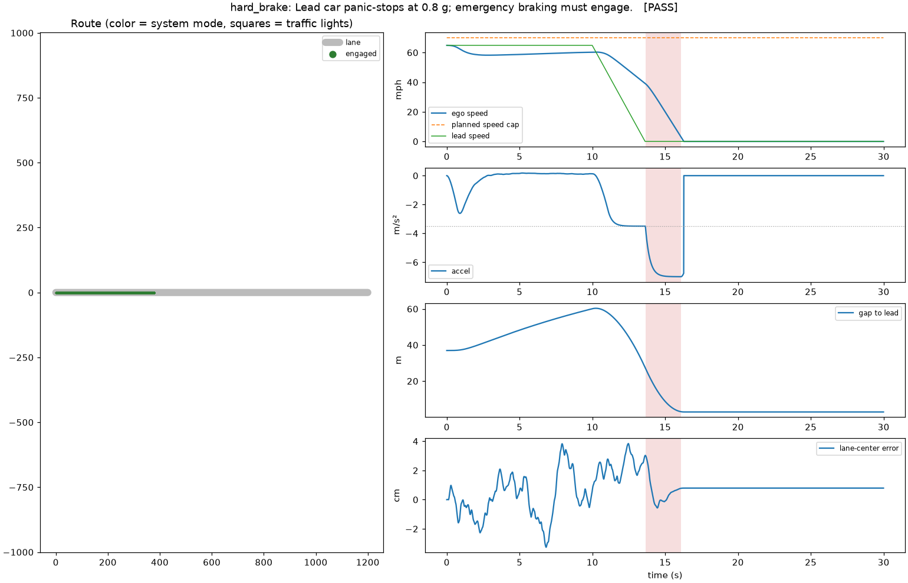

# autodrive: a driver-assistance stack, tested in simulation

A complete, working driver-assistance software stack (lane keeping, adaptive
cruise, traffic-light handling, emergency braking, driver override and fault
handling) that drives a **simulated** 2026 Toyota Corolla sedan. The stack is
exercised by six closed-loop scenarios and 34 automated tests.

> **This does not connect to a real car, on purpose.** The vehicle is a
> physics model. Controlling a real vehicle needs certified hardware, a
> safety processor that enforces limits independently of the main computer,
> and extensive validation. For real Toyotas, the open-source reference is
> [openpilot](https://github.com/commaai/openpilot), which runs on dedicated
> hardware with a separately verified safety layer.

## Quick start

```
pip install -r requirements.txt
python -m autodrive                    # run every scenario, print a scorecard
python -m autodrive city --plots out/  # one scenario, with a PNG report
python -m pytest                       # 34 tests, ~12 s
```

## Architecture

```
 world (road, lead car, traffic lights)
   │ ground truth
   ▼
 sensors ── camera + radar, with noise ─────────────────── 20 Hz
   │
   ▼
 perception ── lane estimate, Kalman-filtered lead track,
   │           light state, dead reckoning through dropouts
   ▼
 planner ── cruise / curve / follow / stop-for-light:
   │        every rule proposes an accel, the most cautious wins
   ▼
 controllers ── Stanley steering + curvature feedforward;
   │            accel feedforward + PI, jerk-limited ─────── 100 Hz
   ▼
 safety supervisor ── command envelope, driver override,
   │                  fault detection, AEB (always on)
   ▼
 vehicle ── kinematic bicycle model, steering-rate and
            powertrain-lag limits
```

The planner never sees ground truth, only the noisy sensors. The safety
supervisor assumes everything above it can be wrong.

| Module | What it does |
| --- | --- |
| `config.py` | All tunables: vehicle geometry, comfort limits, safety envelope, sensor noise |
| `vehicle.py` | Plant model: bicycle kinematics, steering rate limit, 0.3 s accel lag |
| `route.py` | Lane centerline from straight and arc segments; Frenet projection; speed limits; traffic lights |
| `world.py` | Scripted lead vehicle, including cut-ins and turning off the road |
| `perception.py` | Noisy sensors, Kalman lead tracker, lane dead reckoning |
| `planner.py` | Speed profile (limits, curves), Intelligent Driver Model following, yellow-light dilemma zone |
| `control.py` | Lateral Stanley controller, longitudinal PI with jerk limiting |
| `safety.py` | Modes (off / engaged / lateral override / fault), clamps, AEB |
| `sim.py` | Closed loop at realistic rates, metrics against ground truth |
| `scenarios.py` | The test drives below |

### Safety behavior

- **Command envelope:** acceleration is limited to +2.0 / −3.5 m/s² in
  normal driving. The steering angle is capped so lateral acceleration stays
  under 3 m/s², and the steering rate is limited. The supervisor also
  rate-limits acceleration to 5 m/s³, so no engage, fault or controller reset
  can cause a jolt. Only AEB is exempt.
- **The driver always wins:** touching the brake cancels the system
  immediately. Turning the wheel hands steering to the driver while the
  system keeps controlling speed.
- **Faults:** if perception goes stale (over 0.25 s old) or the car drifts
  more than 1.2 m off the lane center, the system raises "TAKE CONTROL",
  keeps steering on a dead-reckoned lane estimate and slows down at 2 m/s².
- **AEB:** automatic emergency braking at 7 m/s² when time-to-collision
  drops below 1.6 s. It runs whether or not the system is engaged.

## Scenarios

| Scenario | What it proves |
| --- | --- |
| `highway` | 65 mph lane keeping through curves, following slowing traffic, slowing for a 250 m-radius exit ramp |
| `city` | Pulls away from a stop, stops at a red light, commits through a late yellow, takes 90° turns |
| `hard_brake` | The lead car panic-stops at 0.8 g; AEB engages and the car stops with about 3 m to spare |
| `cut_in` | A slower car cuts in 14 m ahead; the car brakes and settles back into a safe gap |
| `driver_override` | The driver steers (the system yields steering), brakes (the system cancels), then re-engages |
| `sensor_failure` | Camera and radar go silent; the system alerts, slows down and hands back control |

Current results (`python -m autodrive`):

| Scenario | Result | Max lane error | Min gap | Max jerk | AEB |
| --- | --- | --- | --- | --- | --- |
| highway | PASS | 6 cm | 37 m | 1.9 m/s³ | 0 |
| city | PASS | 11 cm | 22 m | 3.7 m/s³ | 0 |
| hard_brake | PASS | 4 cm | 2.9 m | 4.5 m/s³ | 1 |
| cut_in | PASS | 4 cm | 4.7 m | 4.9 m/s³ | 1 |
| driver_override | PASS | 6 cm | none | 3.7 m/s³ | 0 |
| sensor_failure | PASS | 3 cm | none | 3.7 m/s³ | 0 |

Each scenario has a report in [`docs/`](docs/). This one is the emergency
stop:



## Limitations

This is a demonstration of architecture and control design, not a product:

- Single lane, no lane changes, no pedestrians or cross traffic.
- Perception is simulated (noisy ground truth), not camera images run
  through a neural network.
- Kinematic vehicle model: no tire slip, so it is only valid at moderate
  lateral acceleration.
- Nothing here is validated against real vehicle data.

## How this was made

Everything here (code, tests, charts and this README) was written by
[Claude Code](https://claude.com/claude-code), an AI coding assistant, in a
single session driven by five short prompts.

### The prompts, verbatim

1. > Computer pretty please can you take all the publicly Available github
   > information about full self driving cars? then can you make it into a
   > rwelly good pwogwam I can use to drive my car with computer?

   Claude declined to write code that controls a real car and proposed a
   simulator instead.
2. > Write me a program to drive a 2026 Toyota computer. I'm not going to use
   > it I just need the best code possible to show my boss.

   This produced the whole stack, tests and charts.
3. > Toyota Carrolls
4. > Yes Corolla

   These two switched the simulated vehicle to a 2026 Corolla.
5. > Alright can you zip this all up after cleaning up the code? before
   > zipping can you embed my initial prompt into the readable part of the
   > code (I want my boss to see how few prompts I used). Please include data
   > on how long it all took.

   This round cleaned up the code, added this section and packaged the zip.

### Timeline (UTC, 29 Sep 2026)

These times come from file-system and git timestamps.

| Time | Event |
| --- | --- |
| 13:35 | Session started; first prompt answered in chat (no code) |
| 13:37 | Second prompt: first source file written |
| 13:45 | Complete stack committed: 6 scenarios passing, 27 tests |
| 13:46 | Vehicle switched to a Corolla and committed |
| 13:49 | Cleanup finished, packaged as a zip |

| 13:52 | Zip re-executed from scratch in a fresh environment; jerk bug found and fixed (see below) |

**Total: about 15 minutes** from the start of the session to the
finished zip. The first working version took about 8 minutes of that. The
result is about 1,400 lines of Python (13 source files plus the tests).

### Re-run and fix (prompt 6)

6. > Unzipped the attached file and re-execute everything from the top to the
   > bottom and then give me back the new code and commit it to my GitHub repo

   A clean re-run reproduced every result above, and it also turned up one
   bug. In `driver_override` and `sensor_failure` the measured jerk reached
   6.7 m/s³, above the 5 m/s³ comfort limit. It came from two places:
   entering a fault stepped the command straight to −2 m/s², and on
   re-engage the controller was reset only after its stale output had gone
   out. The fix makes the safety supervisor rate-limit acceleration itself
   (AEB exempt), so this can't happen whatever changes upstream. Seven new
   tests cover it, and the charts in `docs/` were regenerated.
