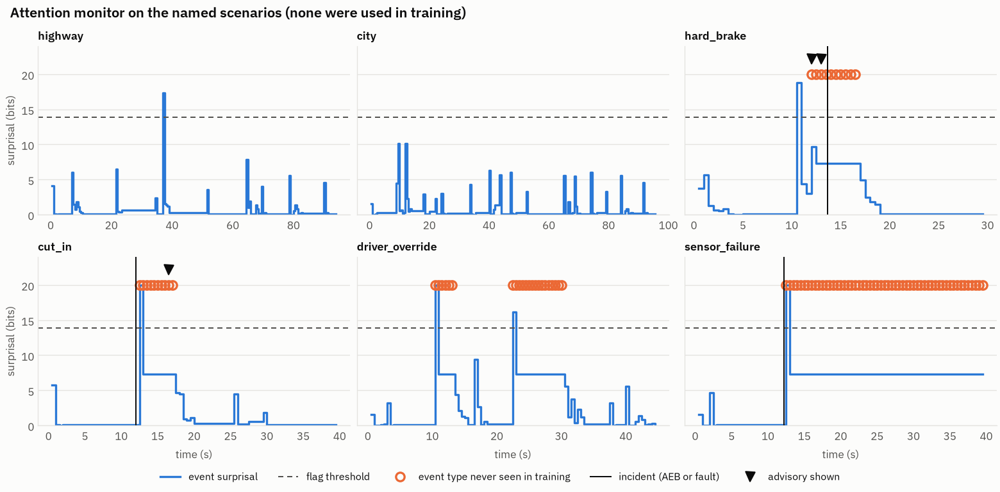

# autodrive: a driver-assistance stack, tested in simulation

> **Licensing: free for everyone, with one exception.** The source is public
> and anyone may use, study, modify and share it, **except** Tesla, SpaceX,
> and any other company that Elon Musk owns, runs or controls (for example
> xAI, X, Neuralink and The Boring Company), including their subsidiaries
> and affiliates. Those companies may not use this software in whole or in
> part. If Elon Musk would like to use it, he can contact the author, Roger
> Feeley Lussier, through GitHub ([@iamtherog](https://github.com/iamtherog)).

A complete, working driver-assistance software stack (lane keeping, adaptive
cruise, traffic-light handling, emergency braking, driver override and fault
handling) that drives a **simulated** 2026 Toyota Corolla sedan. The stack is
exercised by six closed-loop scenarios and 84 automated tests. An offline
[attention monitor](#attention-monitor), an n-gram model of ordinary driving,
watches the drive and warns the driver when it stops looking ordinary. It never
steers or brakes.

> ⚠️ **Fully speculative. Do not use on a car.** This project is a thought
> experiment and a software demonstration. Nothing in it has been
> inspected, validated or certified for a real vehicle. It must not be put
> on a car unless it has first been inspected by an investigator. That
> includes review by an AI investigator (an AI system that audits the code
> and its test evidence), and also full review by qualified human safety
> engineers and the testing and certification that road vehicles legally
> require. An AI inspection alone does not make this code safe to drive.

> **This does not connect to a real car, on purpose.** The vehicle is a
> physics model. Controlling a real vehicle needs certified hardware, a
> safety processor that enforces limits independently of the main computer,
> and extensive validation. For real Toyotas, the open-source reference is
> [openpilot](https://github.com/commaai/openpilot), which runs on dedicated
> hardware with a separately verified safety layer.

## Quick start

```
pip install -r requirements.txt
python -m autodrive                    # run every scenario, print a scorecard
python -m autodrive city --plots out/  # one scenario, with a PNG report
python -m pytest                       # 83 tests, ~1 min (one slow test deselected)
python -m pytest -m slow               # retrains the shipped model and checks it bit for bit (~4 min)

python -m autodrive --attention        # scenarios, plus the attention monitor's flags
python -m autodrive.attention report   # attention monitor scored on the named scenarios
python -m autodrive.attention verify   # artifact digest + bit-for-bit retraining check
python -m autodrive.attention train    # retrain from 1,500 randomized drives (~4 min on 4 cores)
```

Everything runs offline: no network, no remote model, no API calls, no per-use
cost. Code quality gates (`pip install -r requirements-dev.txt`):
`ruff check autodrive tests` and `python -m mypy --strict autodrive` both pass.

## Architecture

```
 world (road, lead car, traffic lights)
   │ ground truth
   ▼
 sensors ── camera + radar, with noise ─────────────────── 20 Hz
   │
   ▼
 perception ── lane estimate, Kalman-filtered lead track,
   │           light state, dead reckoning through dropouts
   ▼
 planner ── cruise / curve / follow / stop-for-light:
   │        every rule proposes an accel, the most cautious wins
   ▼
 controllers ── Stanley steering + curvature feedforward;
   │            accel feedforward + PI, jerk-limited ─────── 100 Hz
   ▼
 safety supervisor ── command envelope, driver override,
   │                  fault detection, AEB (always on)
   ▼
 vehicle ── kinematic bicycle model, steering-rate and
            powertrain-lag limits

 · · · read-only snapshot after every control step (observe.py) · · ·
   ▼
 attention monitor ── n-gram model of nominal driving; advisories are
                      recorded, never fed back into the loop above
```

The planner never sees ground truth, only the noisy sensors. The safety
supervisor assumes everything above it can be wrong.

| Module | What it does |
| --- | --- |
| `config.py` | All tunables: vehicle geometry, comfort limits, safety envelope, sensor noise |
| `vehicle.py` | Plant model: bicycle kinematics, steering rate limit, 0.3 s accel lag |
| `route.py` | Lane centerline from straight and arc segments; Frenet projection; speed limits; traffic lights |
| `world.py` | Scripted lead vehicle, including cut-ins and turning off the road |
| `perception.py` | Noisy sensors, Kalman lead tracker, lane dead reckoning |
| `planner.py` | Speed profile (limits, curves), Intelligent Driver Model following, yellow-light dilemma zone |
| `control.py` | Lateral Stanley controller, longitudinal PI with jerk limiting |
| `safety.py` | Modes (off / engaged / lateral override / fault), clamps, AEB |
| `sim.py` | Closed loop at realistic rates, metrics against ground truth |
| `scenarios.py` | The test drives below |
| `observe.py` | The read-only observer boundary: frozen snapshots in, advisories out, nothing fed back |
| `attention/` | The attention monitor: tokenizer, Kneser-Ney model, SPRT, corpus, training, monitor |

### Safety behavior

- **Command envelope:** acceleration is limited to +2.0 / −3.5 m/s² in
  normal driving. The steering angle is capped so lateral acceleration stays
  under 3 m/s², and the steering rate is limited. The supervisor also
  rate-limits acceleration to 5 m/s³, so no engage, fault or controller reset
  can cause a jolt. Only AEB is exempt.
- **The driver always wins:** touching the brake cancels the system
  immediately. Turning the wheel hands steering to the driver while the
  system keeps controlling speed.
- **Faults:** if perception goes stale (over 0.25 s old) or the car drifts
  more than 1.2 m off the lane center, the system raises "TAKE CONTROL",
  keeps steering on a dead-reckoned lane estimate and slows down at 2 m/s².
- **AEB:** automatic emergency braking at 7 m/s² when time-to-collision
  drops below 1.6 s. It runs whether or not the system is engaged.
- **Traffic lights:** the stop/go decision at a yellow allows for brake
  build-up (0.6 s), and both decisions are latched per light: a car that has
  begun to stop is not flipped to "go" by a slight lag behind the stopping curve,
  and a commitment to go lapses if the car slows right down before the line. See
  [a bug the attention corpus found](#a-bug-the-attention-corpus-found).

## Scenarios

| Scenario | What it proves |
| --- | --- |
| `highway` | 65 mph lane keeping through curves, following slowing traffic, slowing for a 250 m-radius exit ramp |
| `city` | Pulls away from a stop, stops at a red light, commits through a late yellow, takes 90° turns |
| `hard_brake` | The lead car panic-stops at 0.8 g; AEB engages and the car stops with about 3 m to spare |
| `cut_in` | A slower car cuts in 14 m ahead; the car brakes and settles back into a safe gap |
| `driver_override` | The driver steers (the system yields steering), brakes (the system cancels), then re-engages |
| `sensor_failure` | Camera and radar go silent; the system alerts, slows down and hands back control |

Current results (`python -m autodrive`):

| Scenario | Result | Max lane error | Min gap | Max jerk | AEB |
| --- | --- | --- | --- | --- | --- |
| highway | PASS | 6 cm | 37 m | 1.9 m/s³ | 0 |
| city | PASS | 11 cm | 22 m | 3.7 m/s³ | 0 |
| hard_brake | PASS | 4 cm | 2.9 m | 4.5 m/s³ | 1 |
| cut_in | PASS | 4 cm | 4.7 m | 4.9 m/s³ | 1 |
| driver_override | PASS | 6 cm | none | 3.7 m/s³ | 0 |
| sensor_failure | PASS | 3 cm | none | 3.7 m/s³ | 0 |

Each scenario has a report in [`docs/`](docs/). This one is the emergency
stop:


## Attention monitor

A language model has no business steering a car. It can help the person who
is responsible for the car stay attentive to it. The attention monitor is an
n-gram model of ordinary driving that watches the drive and tells the driver,
in a short measured sentence, when something is building up that the safety
supervisor has not already announced.



### How it works

- **A vocabulary of driving events.** Every 0.5 s window becomes one token,
  such as `engaged|follow|a2|t2|l0` (engaged, following, mild braking,
  time-to-collision 3-6 s, within 15 cm of lane center). Each field is the
  window's *worst* value, so a single 10 ms step of emergency braking marks its
  window. The monitor sees only what the system knows (perceived lane offset,
  perceived time-to-collision, mode, planner behavior), never ground truth.
- **A model of ordinary driving.** An interpolated modified Kneser-Ney model
  (Chen & Goodman 1999) is trained on 1,500 randomized nominal drives through the
  real stack: highway and urban routes, gentle traffic, signals timed to the ITE
  formula. Every drive is checked to be nominal (no AEB, fault, collision, red
  light or disengagement) before it is used.
- **Two ways to flag.** An event is flagged when its surprisal given the recent
  events reaches a calibrated threshold, or unconditionally when its type never
  occurred in nominal training. The model has no evidence about a novel event,
  and after one novel event the context backs off, so a second can look *less*
  surprising (the flat plateaus in the figure).
- **The model decides when; templates decide what.** The message is filled from
  measured values ("closing on the vehicle ahead, time to collision 2.7 s"),
  never generated, so every word the driver sees traces to a measurement.

### What the driver sees, and when

The monitor only voices what the system measured and nobody has told the
driver: closing on the vehicle ahead, hard braking, a large lane offset, stale
perception. It is silent while the safety supervisor has an alert up and for
3 s after one clears (those incidents are the supervisor's to announce), while
the driver is steering or driving, and within 3 s of its last advisory unless
the new one is more severe. Everything else it flags goes to a post-drive
review log with the reason it was withheld.

### Where it runs, and where it cannot

It runs as an observer in the simulation loop (`--attention`) and offline over
recorded drives. It cannot affect the vehicle, by construction and by test:

- Observers receive frozen snapshots. `sim.run` records their advisories and
  passes them nowhere.
- A test drives all six scenarios with and without the monitor and requires
  identical logs.
- An observer that raises is detached and the drive continues. That is tested too.

### Results

Named scenarios (none used in training), from `python -m autodrive.attention report`:

| Scenario | Incident | First flag | First advisory shown | Advisories shown |
| --- | --- | --- | --- | --- |
| highway | none | - | - | none (1 flag, kept for review) |
| city | none | - | - | none |
| hard_brake | AEB at 13.65 s | 3.15 s before | 1.65 s before | "hard braking at -3.4 m/s²" (12.0 s), "closing on the vehicle ahead, time to collision 2.7 s" (13.0 s) |
| cut_in | AEB at 12.00 s (the cut-in itself) | - | - | "hard braking at -3.5 m/s²" at 16.5 s, during the follow-up slowdown |
| driver_override | none | - | - | none (driver actions go to review only) |
| sensor_failure | fault at 12.21 s | - | - | none (the supervisor's TAKE CONTROL covers it) |

Held-out nominal drives (300 drives, 3.7 h, never used for fitting or calibration):

| | Rate | 95% interval (exact Poisson) |
| --- | --- | --- |
| Advisories shown to the driver | 0.27 per hour | 0.007 - 1.5 |
| Flags in the review log | 2.7 per hour | 1.3 - 5.0 |

The threshold was calibrated for 1 flag per hour on the calibration split. On
the test split the review-log rate is higher (the interval excludes 1): the
tail of a 5-gram model is estimated from very few events. Driver-facing
advisories stay low because only concrete, measured reasons are shown.

Model selection chose order 5. Each step up won a Wald sequential test with one
trial per independent drive (alpha = beta = 0.01), and held-out perplexity agrees:
9.42, 1.60, 1.56, 1.53, 1.51 for orders 1 to 5.

### How it is verified

- The Kneser-Ney maths: a hand-calculated example, the Chen-Goodman discount
  formula, normalisation to 1 for seen and unseen contexts at every order,
  and continuation counts beating raw frequency. Probabilities are also checked
  bit for bit across serialisation and count order (a real 1-ulp bug found this).
- The statistics: the SPRT's stopping points, its empirical error rates against
  Wald's bounds by simulation, and the Poisson interval against the chi-square
  identity.
- The safety boundary: isolation, a crashing observer, no train/serve skew
  (live scores equal offline scores exactly), every message matching a fixed
  template, and nothing shown during or just after a supervisor alert.
- The artifact: a tampered file or a changed token spec is refused, training is
  identical for any worker count, it runs with sockets disabled, and
  `python -m autodrive.attention verify` retrains the shipped model from its
  recorded seeds and checks the SHA-256 matches bit for bit.

### Credits

The design follows the **Lean N-gram Generator** by **Roger Feeley
Lussier**: an offline Kneser-Ney learner, sequential testing to choose between
candidate models, and a trained artifact bound by digest to the definitions it
was built against. `autodrive/attention` is an independent implementation from
the published algorithms (Kneser & Ney 1995; Chen & Goodman 1999; Wald 1945)
and contains none of that project's source. It departs from it in two places.
The sequential test uses one trial per independent drive rather than per token,
because consecutive tokens are correlated and that voids the test's error bounds.
And the model is used only to score events, never to generate text.

### A bug the attention corpus found

Requiring every training drive to be nominal turned up one randomized urban
drive (seed 386) in which the car ran a red light. The trace showed two planner
weaknesses at yellow lights. A car that had decided to stop could fall slightly
behind the stopping curve because of actuator lag, cross the 3 m/s² yellow limit,
flip to "go" too late to clear, and enter on red. And a commitment to go was
never cancelled, so a car that then stopped short of the line crept across on
red. The planner now allows for brake build-up, latches both decisions, and
lets a go-commitment lapse below 3 m/s. Each part has a regression test, and
mutation testing (disabling each part in turn) confirms every test fails without it.

The deeper cause was in the scenario generator: yellows of 3-4 s regardless of
speed, shorter than the ITE interval (about 3.6 s at 35 mph). That can put a car
at the speed limit where it can neither stop nor clear, which no planner can fix
without knowing the signal timing. Measured on seeds never used while debugging:

| Signal timing | Seeds | Original planner | Fixed planner |
| --- | --- | --- | --- |
| ITE | 20000-22999 | 0 red-light runs | 0 |
| Random 3-4 s | 30000-32999 | 0 | 0 |
| Random 3-4 s | 10000-12999 | 3 | 3 (the same three: can neither stop nor clear) |
| Random 3-4 s | 0-599 | 1 (seed 386) | 0 |

The generator now uses ITE yellow intervals. The six named scenarios are
bit-identical before and after the fix, so the results table and reports above
are unchanged.

## Limitations

This is a demonstration of architecture and control design, not a product:

- Single lane, no lane changes, no pedestrians or cross traffic.
- Perception is simulated (noisy ground truth), not camera images run
  through a neural network.
- Kinematic vehicle model: no tire slip, so it is only valid at moderate
  lateral acceleration.
- Nothing here is validated against real vehicle data.
- The attention monitor has been evaluated only on simulated drives from the
  same generator family it was trained on. Its false-alarm rate on real
  driving is unknown, and a simulated "nominal" is narrower than real traffic.
  It is not a certified driver monitoring system.

## How this was made

Everything here (code, tests, charts and this README) was written by
[Claude Code](https://claude.com/claude-code), an AI coding assistant, in a
single session driven by five short prompts.

### The prompts, verbatim

1. > Computer pretty please can you take all the publicly Available github
   > information about full self driving cars? then can you make it into a
   > rwelly good pwogwam I can use to drive my car with computer?

   Claude declined to write code that controls a real car and proposed a
   simulator instead.
2. > Write me a program to drive a 2026 Toyota computer. I'm not going to use
   > it I just need the best code possible to show my boss.

   This produced the whole stack, tests and charts.
3. > Toyota Carrolls
4. > Yes Corolla

   These two switched the simulated vehicle to a 2026 Corolla.
5. > Alright can you zip this all up after cleaning up the code? before
   > zipping can you embed my initial prompt into the readable part of the
   > code (I want my boss to see how few prompts I used). Please include data
   > on how long it all took.

   This round cleaned up the code, added this section and packaged the zip.

### Timeline (UTC, 29 Sep 2026)

These times come from file-system and git timestamps.

| Time | Event |
| --- | --- |
| 13:35 | Session started; first prompt answered in chat (no code) |
| 13:37 | Second prompt: first source file written |
| 13:45 | Complete stack committed: 6 scenarios passing, 27 tests |
| 13:46 | Vehicle switched to a Corolla and committed |
| 13:49 | Cleanup finished, packaged as a zip |
| 13:52 | Zip re-executed from scratch in a fresh environment; jerk bug found and fixed (see below) |

**Total: about 15 minutes** from the start of the session to the
finished zip. The first working version took about 8 minutes of that. The
result is about 1,400 lines of Python (13 source files plus the tests).

### Re-run and fix (prompt 6)

6. > Unzipped the attached file and re-execute everything from the top to the
   > bottom and then give me back the new code and commit it to my GitHub repo

   A clean re-run reproduced every result above, and it also turned up one
   bug. In `driver_override` and `sensor_failure` the measured jerk reached
   6.7 m/s³, above the 5 m/s³ comfort limit. It came from two places:
   entering a fault stepped the command straight to −2 m/s², and on
   re-engage the controller was reset only after its stale output had gone
   out. The fix makes the safety supervisor rate-limit acceleration itself
   (AEB exempt), so this can't happen whatever changes upstream. Seven new
   tests cover it, and the charts in `docs/` were regenerated.

### Attention monitor (later prompts)

Later prompts added a README safety notice, merged the work, produced a
sizzle video (on the `sizzle-video` branch), and then asked for the author's
offline n-gram generator to be applied to the stack so that it *reinforces*
the driver's role and attention rather than replacing it, runs entirely
offline, is verified end to end, and credits its creator. That produced the
[attention monitor](#attention-monitor) above and the planner fix it uncovered.
